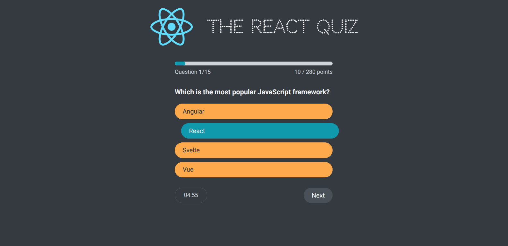

# 🎯 React Quiz App

A simple and responsive **Quiz Application** built with React.  
It fetches quiz questions dynamically from a **JSON Server (Fake REST API)**, making it easy to simulate real backend integration while keeping everything lightweight for development.

---

## 📸 Preview

<p align="center">
  
</p>


---

## ✨ Features
- ⚡ Built with **React (Hooks + Components)**
- 📡 **JSON Server Fake API** for quiz questions
- 📱 Fully **responsive UI** (mobile & desktop friendly)
- ⏱️ Countdown **timer** for each quiz session
- ✅ Instant feedback on answers (correct/wrong states)
- 🏆 Score tracking & high score memory
- 🔄 Smooth loading states with a custom loader

---

## 🛠️ Tech Stack
- **React** (CRA or Vite)
- **JSON Server** (for simulating backend)
- **CSS** (custom responsive styling with Flexbox/Grid & media queries)

---

## 🚀 Getting Started

### 1️⃣ Clone the repository
```bash
git clone https://github.com/your-username/react-quiz-app.git
cd react-quiz-app

npm install
npm install -g json-server
npx json-server --watch db.json --port 4000
json-server --watch db.json --port 4000
npm run dev
